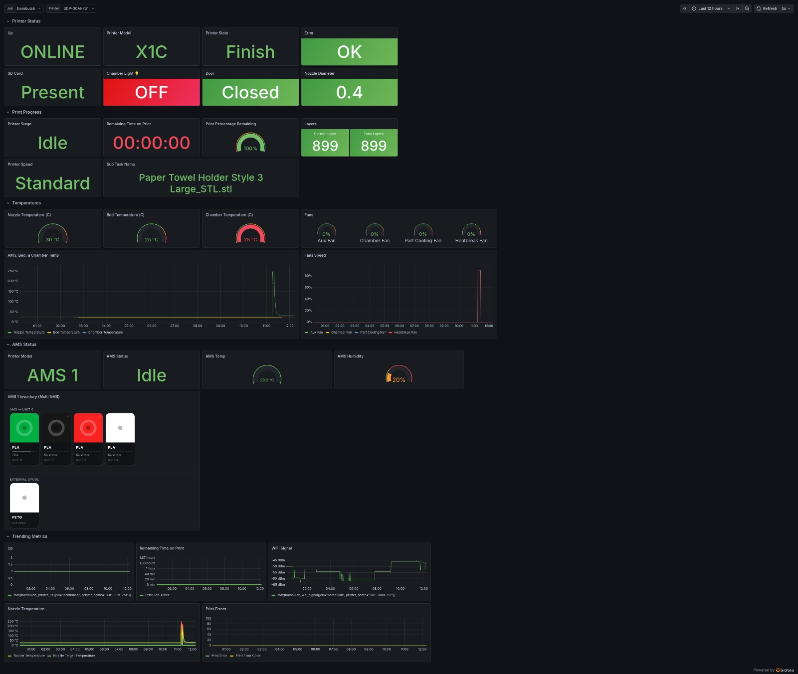

# bambulab-metrics-exporter

[](https://www.python.org/downloads/release/python-3110/)
[](https://github.com/TheBlackBush/bambulab_metrics_exporter/releases)
[](https://github.com/TheBlackBush/bambulab_metrics_exporter/actions/workflows/docker-publish.yml)
[](https://github.com/TheBlackBush/bambulab_metrics_exporter/pkgs/container/bambulab_metrics_exporter)
[](https://ko-fi.com/M4M11W3R7J)

Production-oriented Prometheus exporter for Bambu Lab printers (homelab/self-hosted friendly).

> **Note:** Development and real-world validation of this exporter are currently done only on an **X1C** printer.
> If you want to help improve support for additional printer models, please get in touch with me via GitHub.

---

## Docs / Wiki

Full operator documentation lives in the [GitHub Wiki](https://github.com/TheBlackBush/bambulab_metrics_exporter/wiki).

| Page | Description |
|------|-------------|
| [Quick Start](https://github.com/TheBlackBush/bambulab_metrics_exporter/wiki/Quick-Start) | Get up and running in under 5 minutes |
| [Installation](https://github.com/TheBlackBush/bambulab_metrics_exporter/wiki/Installation) | Docker, Docker Compose, Unraid, GHCR |
| [Configuration](https://github.com/TheBlackBush/bambulab_metrics_exporter/wiki/Configuration) | Full environment variable reference |
| [Prometheus Setup](https://github.com/TheBlackBush/bambulab_metrics_exporter/wiki/Prometheus-Setup) | Scrape config, job examples |
| [Metrics Reference](https://github.com/TheBlackBush/bambulab_metrics_exporter/wiki/Metrics-Reference) | All metrics, PromQL examples |
| [Grafana Dashboard](https://github.com/TheBlackBush/bambulab_metrics_exporter/wiki/Grafana-Dashboard) | Import steps, panel list, alert rules |
| [Troubleshooting](https://github.com/TheBlackBush/bambulab_metrics_exporter/wiki/Troubleshooting) | Common issues and debugging steps |

---

## Table of contents

- [What this does](#what-this-does)
- [Quick start](#quick-start)
- [Local mode vs Cloud mode](#local-mode-vs-cloud-mode)
- [Cloud authentication](#cloud-authentication)
- [Environment variables](#environment-variables)
- [Docker](#docker)
- [Prometheus integration](#prometheus-integration)
- [Operator PromQL examples](#operator-promql-examples)
- [Exported metrics (core)](#exported-metrics-core)
- [Testing](#testing)
- [Known limitations](#known-limitations)

## What this does

- Connects to Bambu printer over **LAN MQTT** (default) or **Cloud MQTT**
- Periodically requests a full state snapshot (`pushall`)
- Parses print state/telemetry into stable Prometheus metrics
- Exposes:
  - `GET /` — landing page with version and status
  - `GET /metrics`
  - `GET /health`
  - `GET /ready`

## Implementation notes

- Supports both LAN MQTT (`local_mqtt`) and Cloud MQTT (`cloud_mqtt`).
- Uses `device/<serial>/report` and `device/<serial>/request` topics.
- Requests full snapshots with `pushall` and maps stable telemetry fields to Prometheus metrics.
- Printer model detection uses a table-driven resolver pipeline (`product_name` → `hw_ver+project_name` → `SN prefix` → legacy fallbacks), including newer SN prefixes such as `22E` (P2S), `093` (H2S), and `094` (H2D).

> **Deployment:** This project is deployed via Docker. There is no pip/PyPI distribution.
> See [Installation](https://github.com/TheBlackBush/bambulab_metrics_exporter/wiki/Installation) for full setup instructions.

## Quick start

```bash
# Pull and run (Local mode — printer must be on same LAN)
docker run -d \
  --name bambulab-exporter \
  -p 9109:9109 \
  -e BAMBULAB_HOST=192.168.1.100 \
  -e BAMBULAB_SERIAL=01P00A000000000 \
  -e BAMBULAB_ACCESS_CODE=12345678 \
  ghcr.io/theblackbush/bambulab_metrics_exporter:latest
```

Or with an env file:

```bash
cp .env.example .env
# edit .env with your values
docker run -d --name bambulab-exporter -p 9109:9109 --env-file .env \
  ghcr.io/theblackbush/bambulab_metrics_exporter:latest
```

Then verify:

```bash
curl http://localhost:9109/health
curl http://localhost:9109/metrics | grep bambulab_printer_connected
```

> For a step-by-step walkthrough see [Quick Start](https://github.com/TheBlackBush/bambulab_metrics_exporter/wiki/Quick-Start) in the Wiki.

## Local mode vs Cloud mode

The exporter supports two transport modes. **`local_mqtt` is the default** — no extra configuration needed if your printer is on the same LAN.

| Mode | `BAMBULAB_TRANSPORT` | When to use |
|------|----------------------|-------------|
| **Local mode** (default) | `local_mqtt` (or omit) | Printer is on your LAN and LAN Mode is enabled |
| **Cloud mode** | `cloud_mqtt` | Printer is not directly reachable (remote, CGNAT, etc.) |

**Local mode — required vars:**

```dotenv
BAMBULAB_HOST=192.168.1.100
BAMBULAB_SERIAL=01P00A000000000
BAMBULAB_ACCESS_CODE=12345678
```

**Cloud mode — required vars:**

```dotenv
BAMBULAB_TRANSPORT=cloud_mqtt
BAMBULAB_SERIAL=01P00A000000000
BAMBULAB_SECRET_KEY=<openssl rand -hex 32>
BAMBULAB_CLOUD_EMAIL=you@example.com
```

> See [Configuration](https://github.com/TheBlackBush/bambulab_metrics_exporter/wiki/Configuration) for the full variable reference.

## Cloud authentication

Cloud credentials are obtained via the `bambulab-cloud-auth` CLI bundled in the container image. No local Python installation is required.

### Container-native OTP flow (recommended)

1. Set `BAMBULAB_CLOUD_EMAIL` in your `.env`. **Do not set `BAMBULAB_CLOUD_CODE` yet.**
2. Start the container. It detects no valid credentials, sends a verification code to your Bambu account email, and exits.
3. Check your email for the code.
4. Add `BAMBULAB_CLOUD_CODE=<code>` to `.env` and restart the container.
5. The container authenticates, stores encrypted credentials to the config volume, and starts normally.
6. **Remove `BAMBULAB_CLOUD_CODE` from `.env`** — codes are single-use; it is not needed for normal operation.

On every subsequent restart, stored credentials are loaded automatically.

### BAMBULAB_CLOUD_CODE lifecycle

`BAMBULAB_CLOUD_CODE` is a **one-time bootstrap variable**. It is needed again only if:

- Stored credentials are missing or cleared (fresh config volume, accidental deletion).
- The Bambu Cloud session expired or account password changed.
- `BAMBULAB_SECRET_KEY` was changed — the encrypted credential file can no longer be decrypted.

In any of these cases, start the container without `BAMBULAB_CLOUD_CODE` to trigger a new code delivery, then follow steps 3–6 above.

> For the manual `bambulab-cloud-auth` flow and full credential lifecycle details, see [Installation](https://github.com/TheBlackBush/bambulab_metrics_exporter/wiki/Installation) and [Quick Start](https://github.com/TheBlackBush/bambulab_metrics_exporter/wiki/Quick-Start).

## Environment variables

| Variable | Required | Default | Description |
|---|---|---|---|
| `BAMBULAB_TRANSPORT` | no | `local_mqtt` | Transport backend (`local_mqtt` or `cloud_mqtt`) |
| `BAMBULAB_HOST` | yes (local) | - | Printer IP/hostname |
| `BAMBULAB_PORT` | no | `8883` | Printer MQTT TLS port |
| `BAMBULAB_SERIAL` | yes | - | Printer serial/device id |
| `BAMBULAB_ACCESS_CODE` | yes (local) | - | Printer LAN access code |
| `BAMBULAB_USERNAME` | no | `bblp` | MQTT username |
| `BAMBULAB_REQUEST_PUSHALL` | no | `true` | Request full snapshot every poll |
| `BAMBULAB_SECRET_KEY` | yes (cloud) | - | Encrypts stored cloud credentials — keep stable |
| `BAMBULAB_CLOUD_EMAIL` | yes (cloud) | - | Bambu account email for OTP flow |
| `BAMBULAB_CLOUD_CODE` | bootstrap only | - | One-time OTP code; remove after first auth |
| `BAMBULAB_CLOUD_USER_ID` | no | - | Cloud user id (if already obtained) |
| `BAMBULAB_CLOUD_ACCESS_TOKEN` | no | - | Cloud access token (if already obtained) |
| `BAMBULAB_CLOUD_MQTT_HOST` | no | `us.mqtt.bambulab.com` | Cloud MQTT broker |
| `BAMBULAB_CLOUD_MQTT_PORT` | no | `8883` | Cloud MQTT port |
| `PRINTER_NAME_LABEL` | no | empty | Custom printer name label (falls back to `BAMBULAB_PRINTER_NAME`) |
| `BAMBULAB_PRINTER_NAME` | no | auto | Real printer name discovered from machine (auto-persisted) |
| `POLLING_INTERVAL_SECONDS` | no | `10` | Polling interval |
| `REQUEST_TIMEOUT_SECONDS` | no | `8` | Per-cycle snapshot timeout |
| `LISTEN_HOST` | no | `0.0.0.0` | HTTP bind host |
| `LISTEN_PORT` | no | `9109` | HTTP port |
| `LOG_LEVEL` | no | `INFO` | Python log level |

> Full reference including PUID/PGID/UMASK and advanced options: [Configuration](https://github.com/TheBlackBush/bambulab_metrics_exporter/wiki/Configuration).

## Docker

### GHCR pre-built image (recommended)

```bash
docker run -d --name bambulab-exporter -p 9109:9109 --env-file .env \
  ghcr.io/theblackbush/bambulab_metrics_exporter:latest
```

### Docker Compose

```bash
docker compose up -d
```

The included `docker-compose.yml` is cloud-first and minimal by default. Required cloud fields are active; optional fields are commented with inline hints. Works for Linux hosts and Unraid (`PUID/PGID/UMASK` optional).

### Build locally

```bash
docker build -t bambulab-metrics-exporter:latest .
docker run -d --name bambulab-exporter -p 9109:9109 --env-file .env \
  bambulab-metrics-exporter:latest
```

### Unraid

A ready-to-import template is included: `unraid-bambulab-metrics-exporter.xml`

1. **Docker → Add Container → Template** — paste XML content or use Template URL.
2. Fill in `BAMBULAB_SECRET_KEY` and required transport fields.
3. Start container and verify `/metrics`.

> See [Installation](https://github.com/TheBlackBush/bambulab_metrics_exporter/wiki/Installation) for full Unraid and PUID/PGID setup.

## Prometheus integration

Use `examples/prometheus/prometheus.scrape.yml` snippet, or equivalent:

```yaml
scrape_configs:
  - job_name: bambulab
    scrape_interval: 15s
    metrics_path: /metrics
    static_configs:
      - targets: ["bambulab-metrics-exporter:9109"]
```

> See [Prometheus Setup](https://github.com/TheBlackBush/bambulab_metrics_exporter/wiki/Prometheus-Setup) for full scrape config, alerting rules, and recording rules.

## Operator PromQL examples

### AMS metrics

- Average humidity index per AMS unit over 15 minutes:

```promql
avg_over_time(bambulab_ams_unit_humidity_index{printer_name="$printer"}[15m])
```

- Lowest remaining filament percentage per printer (all AMS slots):

```promql
min by (printer_name) (bambulab_ams_slot_remaining_percent)
```

- Slots below 15% remaining filament:

```promql
bambulab_ams_slot_remaining_percent{printer_name="$printer"} < 15
```

### Alert tuning examples

- Door open while printing, less sensitive (require 2 minutes open):

```promql
bambulab_door_open{printer_name="$printer"} == 1
and on(printer_name, serial)
bambulab_printer_gcode_state{printer_name="$printer", state="RUNNING"} == 1
```

Suggested alert rule tuning:

```yaml
for: 2m
labels:
  severity: warning
```

- Stale exporter threshold tuned for slower polling environments:

```promql
time() - bambulab_exporter_last_success_unixtime{printer_name="$printer"} > 300
```

Suggested alert rule tuning:

```yaml
for: 2m
labels:
  severity: warning
```

- SD card abnormal status:

```promql
bambulab_sdcard_status_info{printer_name="$printer", status="abnormal"} == 1
```

> More PromQL examples and alert rules: [Metrics Reference](https://github.com/TheBlackBush/bambulab_metrics_exporter/wiki/Metrics-Reference) and [Grafana Dashboard](https://github.com/TheBlackBush/bambulab_metrics_exporter/wiki/Grafana-Dashboard).

## Exported metrics (core)

| Metric | Type | Description |
|---|---|---|
| `bambulab_printer_up` | Gauge | 1 if latest poll returned a valid payload. |
| `bambulab_printer_connected` | Gauge | 1 if MQTT connection is up. |
| `bambulab_print_progress_percent` | Gauge | Print progress percent. |
| `bambulab_print_remaining_seconds` | Gauge | Estimated seconds remaining. |
| `bambulab_print_layer_current` | Gauge | Current print layer. |
| `bambulab_print_layer_total` | Gauge | Total print layers. |
| `bambulab_print_layer_progress_percent` | Gauge | Layer-based progress percent. |
| `bambulab_nozzle_temperature_celsius` | Gauge | Current nozzle temperature. |
| `bambulab_nozzle_target_temperature_celsius` | Gauge | Target nozzle temperature. |
| `bambulab_nozzle_diameter` | Gauge | Nozzle diameter from telemetry. |
| `bambulab_bed_temperature_celsius` | Gauge | Current bed temperature. |
| `bambulab_bed_target_temperature_celsius` | Gauge | Target bed temperature. |
| `bambulab_chamber_temperature_celsius` | Gauge | Chamber temperature. |
| `bambulab_fan_big_1_speed_percent` | Gauge | Big fan 1 speed percent. |
| `bambulab_fan_big_2_speed_percent` | Gauge | Big fan 2 speed percent. |
| `bambulab_fan_cooling_speed_percent` | Gauge | Cooling fan speed percent. |
| `bambulab_fan_heatbreak_speed_percent` | Gauge | Heatbreak fan speed percent. |
| `bambulab_fan_secondary_aux_speed_percent` | Gauge | Secondary auxiliary fan speed percent from `print.device.airduct.parts[id=160]`. |
| `bambulab_printer_error` | Gauge | 1 when printer error code is non-zero. |
| `bambulab_printer_error_code` | Gauge | Raw printer error code (`mc_print_error_code`). |
| `bambulab_print_error_code` | Gauge | Raw `print_error` value from MQTT (legacy alias). |
| `bambulab_print_error` | Gauge | Raw `print_error` value from MQTT. |
| `bambulab_ap_error_code` | Gauge | Raw `ap_err` value from MQTT. |
| `bambulab_printer_gcode_state{state}` | One-hot Gauge | Current gcode state as one-hot labels. |
| `bambulab_subtask_name_info{subtask_name}` | Info Gauge | Current subtask name. |
| `bambulab_fail_reason_info{fail_reason}` | Info Gauge | Current fail reason. |
| `bambulab_printer_model_info{model}` | Info Gauge | Detected printer model. |
| `bambulab_wifi_signal` | Gauge | Wi-Fi signal value (dBm when available). |
| `bambulab_online_ahb` | Gauge | Online AHB flag. |
| `bambulab_online_ext` | Gauge | Online external flag. |
| `bambulab_chamber_light_on` | Gauge | Chamber light status (1/0). |
| `bambulab_work_light_on` | Gauge | Work light status (1/0). |
| `bambulab_xcam_feature_enabled{feature}` | Gauge | XCam feature enable flags. |
| `bambulab_xcam_halt_print_sensitivity_info{level}` | Info Gauge | XCam halt-print sensitivity level (`low`/`medium`/`high`). |
| `bambulab_ams_status_id` | Gauge | AMS status numeric code. |
| `bambulab_ams_status_name{status}` | Info Gauge | AMS status name label. |
| `bambulab_ams_rfid_status_id` | Gauge | AMS RFID status numeric code. |
| `bambulab_ams_rfid_status_name{status}` | Info Gauge | AMS RFID status name label. |
| `bambulab_ams_unit_info{ams_id,ams_model,ams_series}` | Info Gauge | AMS unit identity labels. |
| `bambulab_ams_unit_humidity{ams_id}` | Gauge | AMS humidity raw value. |
| `bambulab_ams_unit_humidity_index{ams_id}` | Gauge | AMS humidity index (1-5). |
| `bambulab_ams_unit_temperature_celsius{ams_id}` | Gauge | AMS temperature. |
| `bambulab_ams_slot_active{ams_id,slot_id}` | Gauge | AMS slot active flag. |
| `bambulab_ams_slot_remaining_percent{ams_id,slot_id}` | Gauge | AMS slot remaining filament %. |
| `bambulab_ams_slot_tray_info{ams_id,slot_id,tray_type,tray_color}` | Info Gauge | AMS slot filament type and color. |
| `bambulab_ams_heater_state_info{ams_id,ams_model,ams_series,state}` | Info Gauge | Gen2 AMS heater/dry state. |
| `bambulab_ams_dry_fan_status{ams_id,ams_model,ams_series,fan_id}` | Gauge | Gen2 AMS drying fan status. |
| `bambulab_ams_dry_sub_status_info{ams_id,ams_model,ams_series,state}` | Info Gauge | Gen2 AMS drying sub-status. |
| `bambulab_external_spool_active` | Gauge | 1 when external spool is active. |
| `bambulab_external_spool_info{external_id,tray_type,tray_info_idx,tray_color}` | Info Gauge | External spool metadata. |
| `bambulab_active_extruder_index` | Gauge | Active extruder index (dual-extruder models). |
| `bambulab_extruder_temperature_celsius{extruder_id}` | Gauge | Per-extruder current temperature. |
| `bambulab_extruder_target_temperature_celsius{extruder_id}` | Gauge | Per-extruder target temperature. |
| `bambulab_extruder_nozzle_info{extruder_id,nozzle_type,nozzle_diameter}` | Info Gauge | Per-extruder nozzle metadata. |
| `bambulab_active_nozzle_info{nozzle_type,nozzle_diameter}` | Info Gauge | Active nozzle metadata. |
| `bambulab_hotend_rack_holder_position_info{position}` | Info Gauge | Hotend rack holder position. |
| `bambulab_hotend_rack_holder_state_info{state}` | Info Gauge | Hotend rack holder state. |
| `bambulab_hotend_rack_slot_state_info{slot_id,state}` | Info Gauge | Hotend rack slot state (`mounted/docked/empty`). |
| `bambulab_hotend_rack_hotend_info{slot_id,nozzle_type,nozzle_diameter}` | Info Gauge | Hotend rack slot nozzle metadata. |
| `bambulab_hotend_rack_hotend_wear_ratio{slot_id}` | Gauge | Hotend rack nozzle wear ratio. |
| `bambulab_hotend_rack_hotend_runtime_minutes{slot_id}` | Gauge | Hotend rack nozzle runtime minutes. |
| `bambulab_sdcard_status_info{status}` | Info Gauge | SD-card status (`present/abnormal/absent`). |
| `bambulab_door_open` | Gauge | Door open flag. |
| `bambulab_lid_open` | Gauge | Lid open flag (H2 family via `stat` bit 24, or direct `lid_open`). |
| `bambulab_wired_network` | Gauge | Wired network detected flag. |
| `bambulab_camera_recording` | Gauge | Camera recording flag. |
| `bambulab_ams_auto_switch` | Gauge | AMS auto-switch flag. |
| `bambulab_filament_tangle_detected` | Gauge | Filament tangle detected flag. |
| `bambulab_filament_tangle_detect_supported` | Gauge | Filament tangle detection support flag. |
| `bambulab_queue_total` | Gauge | Total queued jobs. |
| `bambulab_queue_estimated_seconds` | Gauge | Estimated queue seconds. |
| `bambulab_queue_number` | Gauge | Queue number. |
| `bambulab_queue_status` | Gauge | Queue status numeric code. |
| `bambulab_queue_position` | Gauge | Queue position. |
| `bambulab_spd_lvl` | Gauge | Speed level numeric value. |
| `bambulab_spd_mag` | Gauge | Speed multiplier/percentage. |
| `bambulab_spd_lvl_state{mode}` | One-hot Gauge | Speed mode one-hot labels. |
| `bambulab_stg_cur` | Gauge | Current stage numeric id. |
| `bambulab_print_stage_info{stage}` | Info Gauge | Current stage name label. |
| `bambulab_exporter_scrape_duration_seconds` | Gauge | Duration of last scrape cycle. |
| `bambulab_exporter_scrape_success` | Gauge | 1 when last scrape succeeded. |
| `bambulab_exporter_last_success_unixtime` | Gauge | Unix timestamp of last successful scrape. |

All metrics include stable labels:

- `printer_name` (from `PRINTER_NAME_LABEL` or `BAMBULAB_PRINTER_NAME`)
- `serial` (from `BAMBULAB_SERIAL`)

## Migration note (stage metrics)

- `bambulab_mc_print_stage_state{stage}` was removed.
- Use `bambulab_print_stage_info{stage}` for stage labels and `bambulab_stg_cur` for numeric stage IDs.

## Testing

```bash
pip install -r requirements-dev.txt
# or: pip install -e .[dev]
pytest --cov=src --cov-report=term-missing
```

Maintaining **>90% test coverage** for core modules.

### Test command profiles

```bash
make test              # full suite with coverage gate
make test-unit         # unit suite with coverage gate
make test-integration  # integration-only (runs with --no-cov)
make test-e2e          # e2e-only (runs with --no-cov)
make test-profile      # deterministic smoke profile (integration + e2e)
```

Why `--no-cov` for integration/e2e-only runs?
The project enforces a global coverage threshold in default pytest options, so subset-only runs use `--no-cov` to avoid false negatives unrelated to test correctness.

### Sample payload and expected metrics

- MQTT sample payload: `examples/sample_mqtt_message.json`
- Sample metrics excerpt: `examples/sample_metrics.prom`

These are useful for quick regression checks and dashboard/query validation.

## Known limitations

1. Cloud mode requires a valid access token (a helper tool is included for obtaining it).
2. TLS cert verification is disabled in both LAN/cloud MQTT paths for compatibility with current broker behavior.
3. Some firmware fields can be missing or model-specific; exporter degrades gracefully (`NaN` for missing scalar values).

## Future enhancements

- Automatic access-token refresh using refresh token
- Optional job-name metric via controlled allow-listing (avoid cardinality issues)
- Better fan mapping per model/firmware
- Integration tests with recorded MQTT fixtures

### Dashboard Preview


