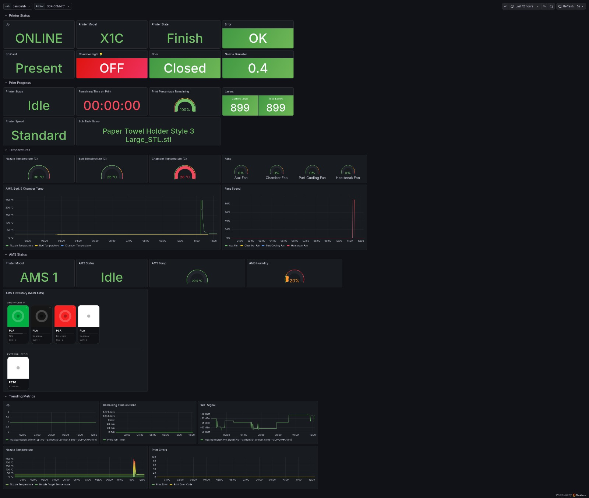

# bambulab-metrics-exporter

[](https://www.python.org/downloads/release/python-3110/)
[](https://github.com/TheBlackBush/bambulab_metrics_exporter/releases)
[](https://github.com/TheBlackBush/bambulab_metrics_exporter/actions/workflows/docker-publish.yml)
[](https://github.com/TheBlackBush/bambulab_metrics_exporter/pkgs/container/bambulab_metrics_exporter)
[](https://github.com/TheBlackBush/bambulab_metrics_exporter/pkgs/container/bambulab_metrics_exporter)
[](https://grafana.com/grafana/dashboards/25033-bambulab-metrics)
[](https://ko-fi.com/M4M11W3R7J)

See your Bambu Lab 3D printer in Grafana: print progress, temperatures, fans, AMS filament
and humidity, errors and more. The exporter runs as a small Docker container, talks to your
printer over your home network (or through Bambu Cloud), and publishes the data for
[Prometheus](https://prometheus.io/) to collect and [Grafana](https://grafana.com/) to chart.



**Supported printers:** X1, X1C, X1E, X2D, P1P, P1S, P2S, A1, A1 mini, A2L, H2D, H2D Pro, H2S
and H2C are recognized. Real-world testing so far is on an **X1C**; if you own another model and
want to help, please open an issue on GitHub.

---

## Contents

- [What you need](#what-you-need)
- [Quick start](#quick-start) (Docker, Unraid, Docker Compose)
- [Connecting the printer](#connecting-the-printer)
- [Optional: set up with environment variables](#optional-set-up-with-environment-variables)
- [Prometheus and Grafana](#prometheus-and-grafana)
- [Metrics](#metrics)
- [How it works](#how-it-works)
- [Known limitations](#known-limitations)
- [More documentation](#more-documentation)
- [Development](#development)

## What you need

- A computer or NAS that runs **Docker** (for example Unraid, Synology, or any Linux machine).
- Your printer either:
  - on the same network, with **LAN Mode** details: IP address, serial number and access code
    (printer screen: **Settings > Network**, or Bambu Studio: **Device > LAN Mode**), or
  - linked to your **Bambu Cloud** account (you log in with your email and a code).
- **Prometheus** and **Grafana** to store and chart the data. A ready-made
  [Grafana dashboard](https://grafana.com/grafana/dashboards/25033-bambulab-metrics/) is
  available.

## Quick start

**1. Create a secret key.** Run this once and keep the result somewhere safe:

```bash
openssl rand -hex 32
```

It locks (encrypts) the printer settings and cloud login that the exporter saves, so they
survive restarts. If you change it later, you only need to connect the printer again.

**2. Start the container:**

```bash
docker run -d \
  --name bambulab-exporter \
  --restart unless-stopped \
  -p 9109:9109 \
  -v /path/to/config:/config/bambulab-metrics-exporter \
  -e BAMBULAB_SECRET_KEY=<your-secret-key> \
  ghcr.io/theblackbush/bambulab_metrics_exporter:latest
```

Replace `/path/to/config` with a folder on your machine and `<your-secret-key>` with the key from
step 1.

**3. Connect the printer:** open `http://<your-server-ip>:9109/auth` in a browser, choose
**Local** or **Bambu Cloud**, and fill in the form. See
[Connecting the printer](#connecting-the-printer) for details.

**4. Check it works:** open `http://<your-server-ip>:9109/`. The status page shows whether the
printer is connected, and `http://<your-server-ip>:9109/metrics` lists the collected data.

### Unraid

1. On the **Docker** tab, scroll to **Template repositories**, add
   `https://github.com/TheBlackBush/bambulab_metrics_exporter` on a new line and click **Save**.
2. Click **Add Container** and pick **bambulab-metrics-exporter** from the **Template** list.
3. Fill in **Secret Key** (step 1 above) and click **Apply**.
4. Open the container's **WebUI**, click **Printer Connection** and connect the printer.

All other template fields are optional.

### Docker Compose

The included [`docker-compose.yml`](docker-compose.yml) needs only the secret key. Put it in a
`.env` file next to the compose file (see [`.env.example`](.env.example)), then:

```bash
docker compose up -d
```

and connect the printer on the `/auth` page as in step 3.

## Connecting the printer

Open `http://<your-server-ip>:9109/auth` (also linked as **Printer Connection** on the status
page) and choose one of:

- **Local (LAN):** enter the printer's IP address, serial number and LAN access code. Best when
  the printer is on the same network as the exporter.
- **Bambu Cloud:** enter your Bambu account email and click **Send code**, then enter the code
  from the email and click **Log in**. The serial number is only needed if your account has more
  than one printer. Use this when the printer is not on the same network.

The exporter connects right away; no restart is needed.

Good to know:

- **Settings are remembered.** They are saved encrypted in the config folder and survive
  restarts and updates (this needs the secret key from step 1).
- **The page wins over environment variables.** Settings saved on the page are used even if the
  container also has printer settings in environment variables (including Unraid template
  fields). **Reset to env vars** on the page removes the saved settings.
- **When the cloud login expires** (for example after a password change), the exporter keeps
  running, shows **Login required** on the page, and waits for you to log in again.
- **Security:** the page has no password. Anyone who can open port 9109 can change which printer
  or account the exporter uses, so keep the port on your home network. Saved passwords and codes
  are never shown on the page.
- **Without a browser:** run `docker exec -it bambulab-exporter bambulab-reauth` (on Unraid:
  open the container's **Console** and run `bambulab-reauth`) for the same cloud login in a
  terminal.

## Optional: set up with environment variables

Everything in this section is optional. Use it if you prefer configuring the container with
variables instead of the `/auth` page, for example in scripted setups.

**Local connection:**

```bash
docker run -d \
  --name bambulab-exporter \
  --restart unless-stopped \
  -p 9109:9109 \
  -v /path/to/config:/config/bambulab-metrics-exporter \
  -e BAMBULAB_SECRET_KEY=<your-secret-key> \
  -e BAMBULAB_HOST=192.0.2.100 \
  -e BAMBULAB_SERIAL=01P00A000000000 \
  -e BAMBULAB_ACCESS_CODE=12345678 \
  ghcr.io/theblackbush/bambulab_metrics_exporter:latest
```

**Bambu Cloud connection** with the email-code flow:

1. Set `BAMBULAB_TRANSPORT=cloud_mqtt`, `BAMBULAB_SERIAL`, `BAMBULAB_SECRET_KEY` and
   `BAMBULAB_CLOUD_EMAIL`, without `BAMBULAB_CLOUD_CODE`, and start the container.
2. It sends one verification code to your email and waits.
3. Add `BAMBULAB_CLOUD_CODE=<code>` and recreate the container.
4. After it logs in, **remove `BAMBULAB_CLOUD_CODE`**: codes work only once, and the saved login
   is used from then on.

You only need a new code if the saved login is lost (new config folder, changed secret key) or
expires. Logging in on the `/auth` page is the easier way in every one of these cases.

You can also keep the variables in a file: copy [`.env.example`](.env.example) to `.env`, edit
it, and add `--env-file .env` to `docker run`.

### Variables

Only `BAMBULAB_SECRET_KEY` is recommended for every setup; printer and login variables are only
needed when you do not use the `/auth` page.

| Variable | Needed | Default | Description |
|---|---|---|---|
| `BAMBULAB_SECRET_KEY` | recommended | - | Encrypts the saved printer settings and cloud login so they survive restarts; keep it unchanged |
| `BAMBULAB_TRANSPORT` | no | `local_mqtt` | `local_mqtt` (LAN) or `cloud_mqtt` (Bambu Cloud) |
| `BAMBULAB_HOST` | env setup, LAN | - | Printer IP address or hostname |
| `BAMBULAB_SERIAL` | env setup | - | Printer serial number |
| `BAMBULAB_ACCESS_CODE` | env setup, LAN | - | Printer LAN access code |
| `BAMBULAB_PORT` | no | `8883` | Printer MQTT port |
| `BAMBULAB_USERNAME` | no | `bblp` | Printer MQTT username |
| `BAMBULAB_CLOUD_EMAIL` | env cloud login | - | Bambu account email for the email-code flow |
| `BAMBULAB_CLOUD_CODE` | env cloud login | - | One-time code from the email; remove after login |
| `BAMBULAB_CLOUD_USER_ID` | no | - | Cloud user id (only for tokens you obtained yourself) |
| `BAMBULAB_CLOUD_ACCESS_TOKEN` | no | - | Cloud access token (only for tokens you obtained yourself) |
| `BAMBULAB_CLOUD_REFRESH_TOKEN` | no | - | Cloud refresh token; renews the access token without a new email code |
| `BAMBULAB_CLOUD_MQTT_HOST` | no | `us.mqtt.bambulab.com` | Bambu Cloud MQTT server |
| `BAMBULAB_CLOUD_MQTT_PORT` | no | `8883` | Bambu Cloud MQTT port |
| `BAMBULAB_REQUEST_PUSHALL` | no | `true` | Ask the printer for a full status report on every poll (read-only) |
| `PRINTER_NAME_LABEL` | no | empty | Name shown for the printer in metrics (default: the printer's own name) |
| `POLLING_INTERVAL_SECONDS` | no | `10` | Seconds between polls |
| `REQUEST_TIMEOUT_SECONDS` | no | `8` | Seconds to wait for a printer report |
| `LISTEN_HOST` | no | `0.0.0.0` | Web server bind address inside the container |
| `LISTEN_PORT` | no | `9109` | Web server port inside the container |
| `AUTH_ALLOWED_HOSTS` | no | empty | Extra host names allowed for the `/auth` page (for example a reverse-proxy name), comma separated |
| `LOG_LEVEL` | no | `INFO` | Log detail: `DEBUG`, `INFO`, `WARNING` or `ERROR` |

Full reference, including `PUID`, `PGID` and `UMASK`:
[Configuration](https://github.com/TheBlackBush/bambulab_metrics_exporter/wiki/Configuration).

## Prometheus and Grafana

**Prometheus:** add the exporter as a scrape target (one target per printer container):

```yaml
scrape_configs:
  - job_name: bambulab
    scrape_interval: 15s
    static_configs:
      - targets: ["<your-server-ip>:9109"]
```

More in [Prometheus Setup](https://github.com/TheBlackBush/bambulab_metrics_exporter/wiki/Prometheus-Setup),
and ready-made alert rules in
[`examples/prometheus/prometheus.alerts.yml`](examples/prometheus/prometheus.alerts.yml).

**Grafana:** import dashboard **25033** from
[Grafana.com](https://grafana.com/grafana/dashboards/25033-bambulab-metrics/) (or the JSON in
[`examples/grafana/`](examples/grafana/)). The AMS filament panel needs the free **Business Text**
plugin; see [Grafana Dashboard](https://github.com/TheBlackBush/bambulab_metrics_exporter/wiki/Grafana-Dashboard).

## Metrics

All metrics start with `bambulab_` and carry `printer_name` and `serial` labels. A few
highlights:

| Metric | What it shows |
|---|---|
| `bambulab_printer_connected` | 1 while the exporter is connected to the printer |
| `bambulab_printer_gcode_state{state}` | Printer state (`IDLE`, `RUNNING`, `PAUSE`, `FINISH`, `FAILED`, ...) |
| `bambulab_print_progress_percent` | Print progress (0-100) |
| `bambulab_print_remaining_seconds` | Estimated time left |
| `bambulab_nozzle_temperature_celsius`, `bambulab_bed_temperature_celsius` | Temperatures (plus `_target_` versions) |
| `bambulab_hms_active_errors{severity}` | Active printer errors by severity |
| `bambulab_ams_slot_remaining_percent{ams_id,slot_id}` | Filament left per AMS slot |
| `bambulab_ams_unit_humidity_index{ams_id}` | AMS humidity level (1-5) |
| `bambulab_firmware_update_available` | 1 when a firmware update is available |

The full list (100+ metrics, with which printers report each one) is in the
[Metrics Reference](https://github.com/TheBlackBush/bambulab_metrics_exporter/wiki/Metrics-Reference).
A sample of the output is in [`examples/sample_metrics.prom`](examples/sample_metrics.prom).

## How it works

- The exporter connects to the printer's MQTT service, either on the LAN (`local_mqtt`) or
  through Bambu Cloud (`cloud_mqtt`), and listens to the printer's status reports
  (`device/<serial>/report`).
- It only reads: the only messages it sends are two read-only requests, `pushall` (a full status
  report, every poll) and `get_version` (the module list, once per connection).
- The printer model is detected from the module list, the serial number prefix, or
  `BAMBULAB_PRINTER_MODEL`. Each model has a hardware profile, so metrics for parts a printer
  does not have (for example a chamber heater) are left empty instead of showing placeholder
  values.
- Web pages and endpoints on port 9109:

  | Path | Purpose |
  |---|---|
  | `/` | Status page |
  | `/auth` | Printer connection page |
  | `/auth/status` | Connection state as JSON |
  | `/metrics` | Data for Prometheus |
  | `/health` | Liveness check (for container health checks) |
  | `/ready` | Ready once the first printer data has arrived |

## Known limitations

1. Only the X1C has been tested on real hardware; other models are recognized from their data
   and may report some values differently.
2. One container monitors one printer. For several printers, run one container per printer.
3. The MQTT connection is encrypted, but the printer's certificate is not verified (the printers
   use self-signed certificates).
4. Some values depend on the printer model and firmware; missing values are left empty rather
   than shown as zero.

## More documentation

The [GitHub Wiki](https://github.com/TheBlackBush/bambulab_metrics_exporter/wiki) has the full
guides:

| Page | Description |
|------|-------------|
| [Quick Start](https://github.com/TheBlackBush/bambulab_metrics_exporter/wiki/Quick-Start) | Step-by-step setup |
| [Installation](https://github.com/TheBlackBush/bambulab_metrics_exporter/wiki/Installation) | Docker, Docker Compose, Unraid |
| [Configuration](https://github.com/TheBlackBush/bambulab_metrics_exporter/wiki/Configuration) | All settings |
| [Prometheus Setup](https://github.com/TheBlackBush/bambulab_metrics_exporter/wiki/Prometheus-Setup) | Scrape config, alert and recording rules |
| [Metrics Reference](https://github.com/TheBlackBush/bambulab_metrics_exporter/wiki/Metrics-Reference) | Every metric, per-model support, PromQL examples |
| [Grafana Dashboard](https://github.com/TheBlackBush/bambulab_metrics_exporter/wiki/Grafana-Dashboard) | Import steps and panels |
| [Troubleshooting](https://github.com/TheBlackBush/bambulab_metrics_exporter/wiki/Troubleshooting) | Common problems |

Release notes: [CHANGELOG.md](CHANGELOG.md).

## Development

The project ships only as a Docker image (no PyPI package). To run the tests:

```bash
python3 -m venv .venv
.venv/bin/python -m pip install -r requirements-dev.txt && .venv/bin/python -m pip install -e .
make test   # full suite with coverage gate
make lint
```

To build the image locally: `docker build -t bambulab-metrics-exporter:latest .`
